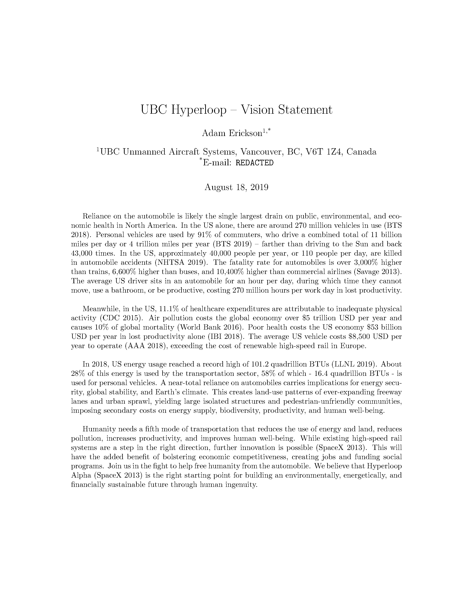

# UBC Hyperloop Team - Vision Statement

In August of 2019, I presented a vision statement to the UBC Engineering Department on the need to create a UBC Hyperloop student design team. This vision statement was motivated by challenges currently facing society and my experience in helping to found the UBC UAS team.

The creation of state-of-the-art renewable rail systems would radically transform our way of life, greatly alleviating many of the world's most pressing challenges. I encourage you to read the letter and support the creation of associated technologies!

This need has been a driving factor in my decision to found [Nervosys](https://nervosys.ai). We aim to solve difficult challenges in AI for robotics, needed to greatly advance automation technology for the betterment of society. 🦾 🧠

<p align="center">
  
</p>

Below are the `BASH` commands used to generate a PDF and convert it to 300-dpi PNG and JPG images:

```bash
pdflatex main.tex
gs -dSAFER -dBATCH -dNOPAUSE -sDEVICE=png16m -r300 -o main.png main.pdf
gs -dSAFER -dBATCH -dNOPAUSE -sDEVICE=jpeg   -r300 -o main.jpg main.pdf
```
